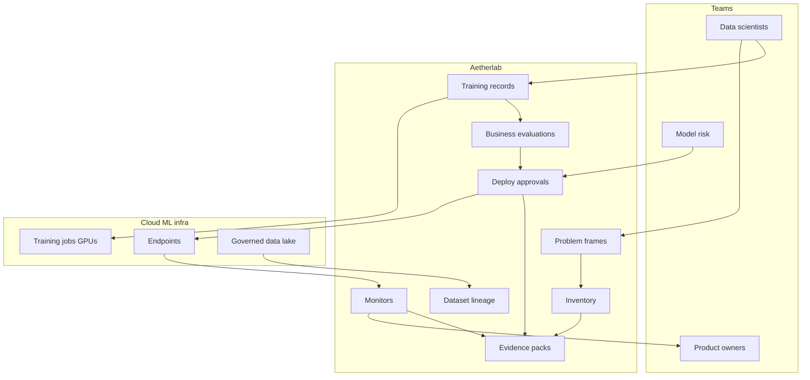

# Aetherlab

**Source:** `ai-in-financial/ai-in-financefinal-aws-80316055745/`
**Domain:** `ai-fin`
**One-liner:** A regulated cloud AI factory that lets banks build, train, deploy, monitor, and retire models under a single control plane—so “go build” on cloud GPUs does not become ungoverned shadow AI.
**Wedge:** Bank AI platforms / MLOps teams at AWS-heavy or multi-cloud FS institutions that already run SageMaker-class tooling but lack productised model inventory, approval gates, lineage, and production monitors for examiners.
**Positioning:** Cloud AI factory for banks. The AWS evangelist deck traces AI from Dartmouth through FinCEN’s early AML system, expert financial planners, and modern stacks (algorithms + data + GPUs + cloud), then sells the ML process and AWS ML stack with FINRA-scale surveillance and Nasdaq analytics as proof that regulated workloads already run in cloud. Aetherlab is the bank-owned factory layer on top: problem framing → data → train → evaluate → deploy → monitor → retrain, with evidence packs—distinct from Aegira’s fraud cases, Lendora’s credit decisions, and Ordovex’s trading kills.

## Market research synthesis

### Thesis from source

Adrian Hornsby’s AWS “AI in Finance: Moving forward!” frames AI as systems performing tasks that usually require human intelligence, then walks history from McCarthy (1955) and the perceptron through Protrader’s 1980s market prediction, 1990s expert systems (PlanPower; Chase Lincoln planning; FinCEN AML), the AI winter, and the modern advent of algorithms + data + GPU acceleration + cloud. It catalogues supervised learning use cases (fraud, personalisation, churn, support routing), deep architectures (CNN, LSTM, GAN, CapsNet), and an end-to-end AI process: problem framing, data collection/integration/prep, training/tuning, evaluation, deployment, monitoring/debugging, and retrain when business goals are unmet. “Hidden gems” include transfer learning and model zoos to avoid training from scratch.

AWS proof points include FINRA loading ~35B rows nightly to S3/EMR for market surveillance, Nasdaq loading ~5B rows to Redshift in a 4–6 hour window, Fraud.net on Amazon ML, Bankinter credit-risk simulation needing ≥5M simulations, Capital One’s fraud/lending/chatbots on AWS, claims that ~80% of G-SIBs are AWS customers, and 96% of the 2016 Forbes FinTech 50 on AWS. The stack spans application services (Rekognition, Polly, Lex, Transcribe, Translate, Comprehend) through SageMaker and P3 GPU instances.

The product insight for a bank buyer is not “use AWS.” It is an AI factory control plane that makes the deck’s process real under model risk: every model has a problem statement, data lineage, training job, evaluation against business goals, deployment approval, production monitors, and retirement—preventing the shadow notebooks that examiners hate.

### Buyer & economic model

- **Primary buyer:** Head of AI Platform / MLOps or CIO office for data & AI.
- **Users:** data scientists, ML engineers, model risk validators, product owners of AI use cases, cloud security/IAM admins, internal audit.
- **Budget owner / value metric:** AI platform and cloud-consumption budget. Value metric is time-to-approved-production and % of production models with complete lineage/monitor evidence.
- **Competing status quo:** raw SageMaker/EMR projects per team; SharePoint model inventories; annual validation theatre; FINRA-scale data jobs without reusable governance wrappers.

### Domain constraints

- **Regulatory / trust / safety:** model risk management, data residency, exam evidence, segregation of duties between builders and validators, concentration risk on cloud providers.
- **Data sensitivity:** training sets may include confidential market, customer, or AML data; access must be purpose-bound.
- **Change-management realities:** quants bypass platform friction; Aetherlab must be the fastest compliant path, not a parallel bureaucracy.

## Business requirements

- BR-1: Every model must have a registered problem framing and business-goal metric before training resources are granted at scale.
- BR-2: Training datasets must carry lineage (source systems, extraction time, permitted purpose) visible to validators.
- BR-3: Evaluation against declared business goals is mandatory; “model accuracy only” cannot pass production gates.
- BR-4: Deployment to production requires dual control separating builders from validators.
- BR-5: Production monitors (drift, performance, latency, cost) must be attached or the deployment is blocked.
- BR-6: Transfer learning / model-zoo base weights must be inventoried as dependencies with licence/risk notes.
- BR-7: Retirement and rollback must be first-class; orphaned endpoints are a control fail.
- BR-8: Evidence packs for examiners must export lineage, approvals, metrics, and incidents for any model ID.
- BR-9: Cloud spend by model and team must be visible to curb GPU sprawl.
- BR-10: High-risk use classes (credit, AML, trading, consumer adverse action) must require stricter gates than low-risk experimentation.
- BR-11: The factory orchestrates and records—it does not replace domain products’ business APIs (fraud, credit, NLG, etc.).
- BR-12: Multi-cloud or hybrid training locations must still report into the same inventory (no dark clusters).

## User stories

Canonical user stories live in sibling [USER_STORIES.md](USER_STORIES.md).

## System design

### Overview

Aetherlab is the control plane above cloud training/inference infrastructure. Teams register projects, attach datasets with lineage, launch training, record evaluations, request deploy approvals, attach monitors, and retire models. It integrates with SageMaker-class jobs, feature stores, and endpoint registries without locking the bank to a single hyperscaler API in the product model.

### Actors & boundaries

- **Actors:** data scientist, ML engineer, validator, product owner, platform admin, auditor.
- **Trust boundary:** cloud accounts remain the bank’s; Aetherlab stores metadata, approvals, and evidence. Raw training data stays in governed lake/warehouse locations.
- **Human-in-the-loop points:** production approval; high-risk exceptions; forced retirement.

### Core capabilities

1. **Model and project inventory**.
2. **Problem framing and KPI registry**.
3. **Dataset lineage and access grants**.
4. **Training job orchestration records**.
5. **Evaluation against business goals**.
6. **Deployment approval and endpoint registry**.
7. **Production monitoring and retrain triggers**.
8. **Evidence pack export and retirement**.

### Conceptual data

- **Primary entities:** Project, Model, ProblemFrame, DatasetLineage, TrainingJob, EvaluationReport, DeploymentApproval, Endpoint, Monitor, EvidencePack, Retirement.
- **Critical events:** framed, trained, evaluated, approved, deployed, drifted, retrained, retired, pack exported.
- **Retention / audit needs:** lineage and approvals retained for model-risk and exam cycles; training logs retained per policy; personal training samples minimised.

### Integrations (conceptual)

- **Systems of record:** cloud ML platforms, data catalogue, IAM/secrets, ITSM, model-risk inventory.
- **Upstream signals:** data quality monitors, cost APIs, endpoint metrics.
- **Downstream actions:** deploy/rollback, ticket creation, examiner packs, budget alerts.

### High-level architecture

### Success metrics

- **Leading:** % production endpoints registered; median time framing→approved deploy; monitor coverage; zombie-job kill rate.
- **Lagging:** exam findings on model inventory gaps; cloud ML cost per approved model; incident rate from unmonitored models; shadow-AI discovery count.

## OpenAPI skeleton

Canonical HTTP surface lives in sibling [openapi.yaml](openapi.yaml). Summary:

- **Base path:** `/v1/...`
- **Auth:** `X-API-Key` for CI/CD and cloud agents; Bearer JWT for operators and validators.
- **Resource groups:** Projects, Models, Datasets, TrainingJobs, Evaluations, Deployments, Monitors, EvidencePacks.
